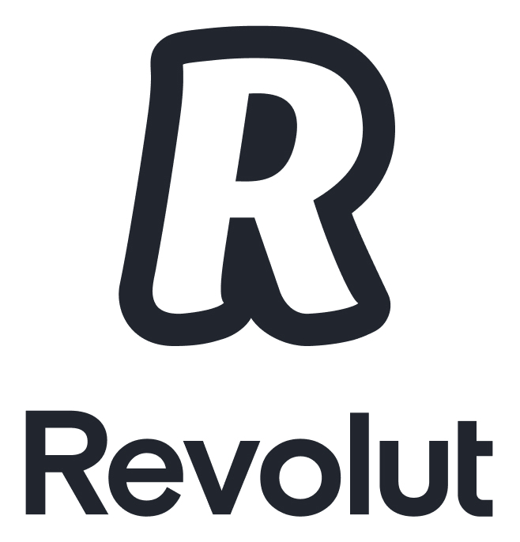

# CyberDeck Project Intro
This is a clone of https://github.com/shajen/rtl-sdr-scanner-cpp.git, and excellent project.
I'm using the devel version which provides the latest features which I find runs better on the Raspberry Pi.

I'm setting this up on a Raspberry Pi 5, 8GB of RAM.  Booting from Crucial P3 Plus 1TB PCIe NVME M.2 SSD drive.
The Pi5 provides plenty of horsepower to drive SDR-Scanner.

Supported gain values (29): 0.0 0.9 1.4 2.7 3.7 7.7 8.7 12.5 14.4 15.7 16.6 19.7 20.7 22.9 25.4 28.0 29.7 32.8 33.8 36.4 37.2 38.6 40.2 42.1 43.4 43.9 44.5 48.0 49.6


## Introduction All content below this point has been written RTL-SDR-Scanner team and provides a general overview of that project.

This project contains sdr scanner written in `c++` to **scan and record multiple interesting frequencies bandwidth in the same time** (eg. 108 MHz, 144 MHz, 440 Mhz,  etc). This is possible by switching quickly between frequencies bandwidth.

Sdr scanner also allows you to record multiple transmissions simultaneously (if they are transmitted on the same band). For example, if one transmission is on 145.200 MHz and the other is on 145.600 MHz, the scanner will record and save both!

It also provides easy but very powerful **web panel** to explore recordings, spectrograms and configure sdr device.

# Supported devices

Sdr scanner use [SoapySDR](https://github.com/pothosware/SoapySDR) library to get data so it support all devices that are supported by `SoapySDR`. Full list of supported devices [here](https://github.com/shajen/rtl-sdr-scanner-cpp/wiki/Supported-devices).

# Supported modulation

- `FM`
- `AM`

# YouTube

[introduction video](https://www.youtube.com/watch?v=YzQ2N0VkKvE) - thanks to **Tech Minds**!

[introduction video](http://www.youtube.com/watch?v=TSDbcb7wSjs) - old version

# Screens

## Sample data collected

| Spectrogram | Transmission |
| - | - |
|  |  |
|  |  |

## Configuration

| App configuration | Groups |
| - | - |
|  |  |

# Quickstart

## Install docker

If you do not have `docker` installed, follow the instructions [here](https://docs.docker.com/desktop/) to install `docker` and `docker compose`.

## Run

```
git clone https://github.com/shajen/rtl-sdr-scanner-cpp.git ~/sdr
cd ~/sdr
nano .env # customize settings if you want: timezone, admin account and other
docker compose up -d
```

## Stop

```
cd ~/sdr
docker compose down
```

## Web panel

Default web panel address is [http://localhost:8000/](http://localhost:8000/), default login: `admin`, password: `password`. Useful links:
- [configuration](http://localhost:8000/sdr/config/)
- [configuration manual](https://github.com/shajen/rtl-sdr-scanner-cpp/wiki/Configuration)
- [admin panel](http://localhost:8000/admin/)
- [spectrograms](http://localhost:8000/sdr/spectrograms/) (wait for data to collect after start and configure)
- [transmissions](http://localhost:8000/sdr/transmissions/) (wait for data to collect after start and configure)

Sources of panel [here](https://github.com/shajen/monitor).

## Update

To update to latest version just update git, images and run it.
```
cd ~/sdr
docker compose down
git pull
docker compose pull
docker compose up -d
```

## Stop and remove data

It removes all collected data and configuration!
```
cd ~/sdr
docker compose down --volumes
```

# AI

It uses `AI` model from [https://www.tensorflow.org/lite/inference_with_metadata/task_library/audio_classifier](https://www.tensorflow.org/lite/inference_with_metadata/task_library/audio_classifier) to classify whether a transmission is speech or noise.

# Wiki

Many useful instructions and information are on the [wiki](https://github.com/shajen/rtl-sdr-scanner-cpp/wiki).

# Contributing

In general don't be afraid to send pull request. Use the "fork-and-pull" Git workflow.

1. **Fork** the repo
2. **Clone** the project to your own machine
3. **Commit** changes to your own branch
4. **Push** your work back up to your fork
5. Submit a **Pull request** so that we can review your changes

NOTE: Be sure to merge the **latest** from **upstream** before making a pull request!

# Donations

If you enjoy this project and want to thanks, please use follow link:

[](https://www.paypal.com/donate/?hosted_button_id=6JQ963AU688QN)
[](https://revolut.me/borysm2b)


BTC address: 18UDYg9mu26K2E3U479eMvMZXPDpswR7Jn

# License

[](https://www.gnu.org/licenses/gpl.html)

- *[GPLv3 license](https://www.gnu.org/licenses/gpl.html)*
